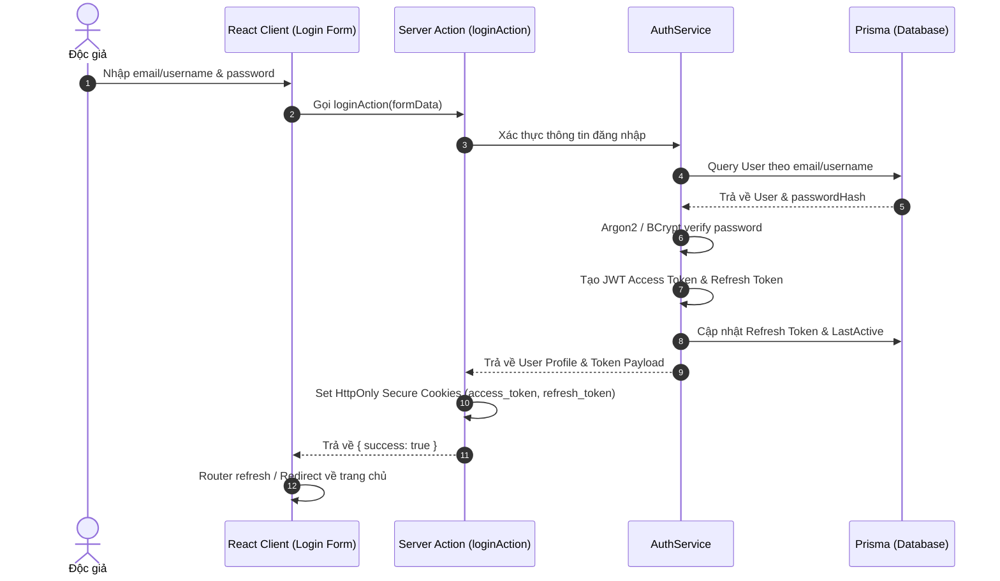
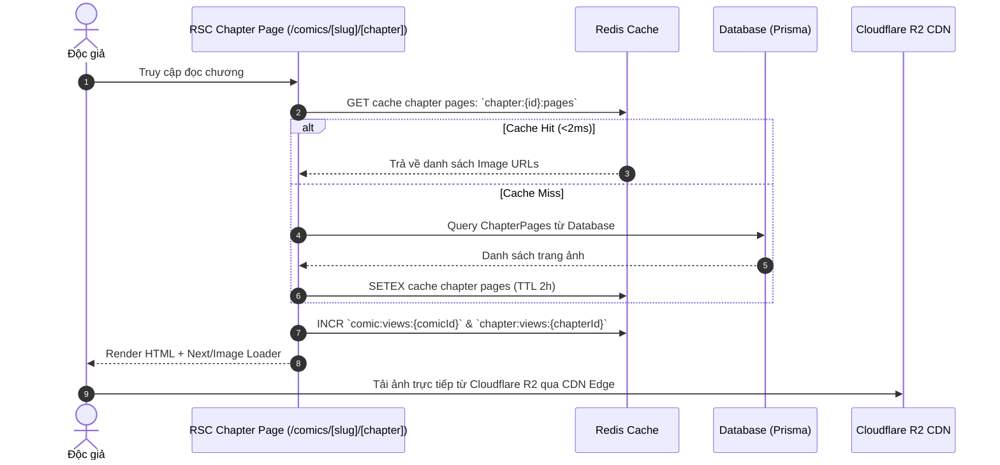
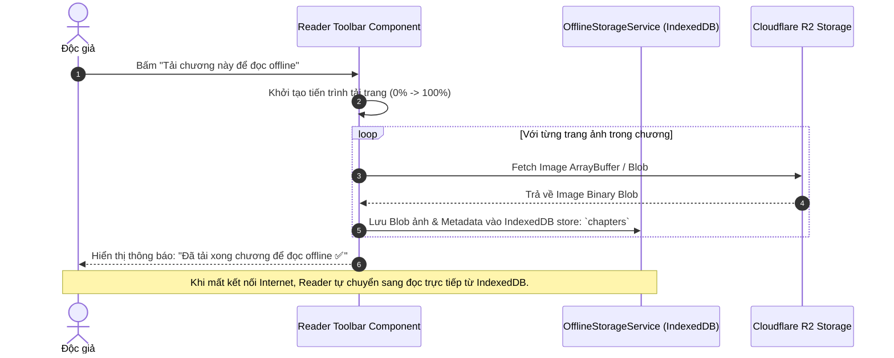

# 🏗️ Kiến Trúc Hệ Thống TruyenKomi (Next.js Fullstack Architecture)

Nền tảng đọc và quản lý truyện tranh trực tuyến **TruyenKomi** phiên bản **Next.js Fullstack** được thiết kế theo mô hình **Unified Fullstack Architecture** dựa trên **Next.js 15+ (App Router)**. Kiến trúc này tận dụng **React Server Components (RSC)** để tối ưu SEO và tốc độ nạp trang ban đầu (TTFB < 100ms), kết hợp **Server Actions / Route Handlers** cho Backend API, **Redis Caching & Batch Buffering**, **Cloudflare R2** cho Object Storage, và **BullMQ Worker** cho hệ thống cào truyện tự động.

---

## 📌 1. Tổng Quan Kiến Trúc (System Architecture Overview)

```mermaid
graph TD
    subgraph Client & Edge Layer
        Client[Web Browser / Mobile PWA]
        CF[Cloudflare Edge CDN / WAF / Turnstile]
    end

    subgraph Next.js Fullstack Engine - App Router
        subgraph Frontend Layer - React 19
            RSC[React Server Components - SSR / ISR]
            RCC[Client Components - Interactive UI & PWA Reader]
        end

        subgraph Backend & API Layer
            MW[Edge Middleware - JWT Auth / RBAC / Rate Limit]
            SA[Server Actions - Form Mutations & Actions]
            RH[Route Handlers - REST API / Webhooks]
            SSE[SSE Stream / WebSocket Server - Live Readers & Comments]
        end

        subgraph Core Services Layer
            S_Auth[Auth & User Service]
            S_Comic[Comic & Chapter Service]
            S_Cache[Multi-tier Cache Service]
            S_Game[Gamification & EXP Service]
            S_Search[Search Engine Service]
            S_Store[Cloudflare R2 Storage Service]
        end
    end

    subgraph Data & Storage Layer
        DB[(Primary Database: Neon Serverless PostgreSQL - Prisma ORM)]
        Redis[(Upstash Serverless Redis - REST & TCP)]
        Storage[(Cloudflare R2 Object Storage)]
    end

    subgraph Background & Worker Layer
        Worker[BullMQ Ingestion Worker]
        Crawler[Crawler Engine + Sharp Image Pipeline]
        ViewWorker[Batch View Buffering Worker]
    end

    %% Flow Connections
    Client <-->|HTTPS / HTTP2 / PWA| CF
    CF <-->|Reverse Proxy| MW
    MW --> RSC
    MW --> RCC
    MW --> SA
    MW --> RH
    
    RSC & RCC & SA & RH --> S_Auth & S_Comic & S_Cache & S_Game & S_Search & S_Store
    
    S_Auth & S_Comic & S_Game & S_Search <-->|Prisma ORM / Connection Pool / pg_trgm| DB
    S_Cache <-->|@upstash/redis / Cache Tag Invalidation| Redis
    S_Store <-->|AWS S3 SDK v3 / Presigned URLs| Storage

    Crawler -->|Extract & Sharp Optimize| Storage
    Crawler -->|Push Payload via Ingestion API| RH
    RH -->|Push Jobs| Worker
    Worker -->|Sync Metadata & Chapters| DB

    ViewWorker <-->|Buffer & Flush Batch Views| Redis & DB
    SSE <-->|Real-time Events| Redis
```

---

## 🛠️ 2. Công Nghệ Sử Dụng (Technology Stack)

| Phân Hệ | Công Nghệ Lựa Chọn | Vai Trò & Mục Đích |
| :--- | :--- | :--- |
| **Fullstack Framework** | **Next.js 15+ (React 19, App Router)** | Hợp nhất FE & BE, hỗ trợ SSR, ISR, Server Actions và Route Handlers. |
| **Language & Typing** | **TypeScript 5.x** | Đảm bảo Type-safety từ Frontend đến Backend DB Schema. |
| **Styling & UI Engine** | **Tailwind CSS + Lucide Icons + Framer Motion** | Giao diện tối ưu, Dark/Light Mode, Sepia Eye-Care, micro-animations. |
| **State Management** | **Zustand + TanStack React Query** | Quản lý state cục bộ cho Reader Settings, History, Filters và Client Cache. |
| **Database & ORM** | **Prisma ORM + Neon PostgreSQL** | Serverless PostgreSQL với Connection Pooler (`DATABASE_URL` và `DIRECT_URL`). |
| **Auth & Security** | **Auth.js v5 (NextAuth)** + **Jose / Argon2** | Quản lý Access/Refresh Token trong HttpOnly Cookies, RBAC, Rate Limiting. |
| **Distributed Cache** | **`@upstash/redis` + `unstable_cache`** | Serverless Redis qua HTTP REST API (Edge-ready) và Multi-tier Tag Caching. |
| **Rate Limiting** | **`@upstash/ratelimit`** | Chống Spam, Brute-force và DDoS tại Edge Middleware. |
| **Search Engine** | **PostgreSQL Full-Text (`pg_trgm` + `unaccent`)** | Tìm kiếm truyện tức thì (<15ms), Typo-tolerant, tiếng Việt không dấu tích hợp sẵn trên Neon. |
| **Object Storage** | **AWS SDK v3 (`@aws-sdk/client-s3`)** | Giao tiếp S3-compatible API với **Cloudflare R2** (hoặc AWS S3). |
| **Image Processing** | **Sharp + Next/Image Optimizer** | Tự động tối ưu WebP/AVIF, Lazy Loading, CDN caching cho hàng triệu trang truyện. |
| **Queue & Workers** | **BullMQ + Redis** | Xử lý cào truyện ngầm, tối ưu ảnh, batching update lượt xem theo chu kỳ. |
| **Offline & PWA** | **`next-pwa` + `idb` (IndexedDB)** | Cho phép tải chương/truyện đọc offline, Service Worker caching. |
| **Logging & Health** | **Pino / Winston** | Ghi log có cấu trúc (Structured Logging) và Endpoint `/api/health` kiểm tra sức khỏe hệ thống. |

---

## 📁 3. Cấu Trúc Thư Mục Chuẩn (`src/`)

```
truyenkomi-next/
├── prisma/
│   ├── schema.prisma            # Schema định nghĩa Entities và Relations
│   └── migrations/              # Lịch sử Database Migrations
├── public/                      # Static assets, PWA manifest, icons
│   ├── manifest.json
│   ├── sw.js
│   └── icons/
├── src/
│   ├── app/                     # Next.js App Router
│   │   ├── (auth)/              # Route Group: Auth Pages
│   │   │   ├── login/page.tsx
│   │   │   ├── register/page.tsx
│   │   │   └── forgot-password/page.tsx
│   │   ├── (main)/              # Route Group: Độc giả
│   │   │   ├── layout.tsx       # Main Layout (Navbar, Footer, Notifications)
│   │   │   ├── page.tsx         # Trang chủ (Banner, Hot Comics, Mới Cập Nhật - ISR)
│   │   │   ├── comics/          # Danh sách & Bộ lọc truyện
│   │   │   │   ├── page.tsx
│   │   │   │   └── [slug]/      # Chi tiết truyện (/comics/dao-hai-tac)
│   │   │   │       ├── page.tsx
│   │   │   │       └── [chapter]/ # Bộ đọc chương (/comics/dao-hai-tac/chuong-1)
│   │   │   │           └── page.tsx
│   │   │   ├── categories/page.tsx
│   │   │   ├── history/page.tsx
│   │   │   ├── followed/page.tsx
│   │   │   ├── offline/page.tsx # Tủ truyện offline (IndexedDB)
│   │   │   ├── profile/page.tsx # Hồ sơ, Cấp bậc EXP, Gamification
│   │   │   └── search/page.tsx
│   │   ├── (admin)/             # Route Group: Quản trị (Admin Protected)
│   │   │   ├── layout.tsx       # Admin Sidebar & Dashboard Shell
│   │   │   └── admin/
│   │   │       ├── page.tsx     # Thống kê tổng quan & Charts
│   │   │       ├── comics/      # Quản lý truyện & Form thêm/sửa
│   │   │       ├── chapters/    # Quản lý chapter & Upload ảnh
│   │   │       ├── genres/      # Quản lý thể loại
│   │   │       ├── comments/    # Kiểm duyệt bình luận
│   │   │       ├── reports/     # Xử lý báo lỗi chương/ảnh
│   │   │       └── users/       # Phân quyền & Quản lý User
│   │   ├── api/                 # Route Handlers (Backend REST API & Webhooks)
│   │   │   ├── auth/[...nextauth]/route.ts
│   │   │   ├── comics/route.ts
│   │   │   ├── chapters/[id]/route.ts
│   │   │   ├── comments/route.ts
│   │   │   ├── ratings/route.ts
│   │   │   ├── upload/route.ts  # Presigned URL Cloudflare R2
│   │   │   ├── crawler/ingest/route.ts # Endpoint nhận truyện từ crawler
│   │   │   ├── realtime/sse/route.ts   # Server-Sent Events (Live reader count)
│   │   │   └── health/route.ts  # Health check endpoint
│   │   ├── global-error.tsx
│   │   ├── not-found.tsx
│   │   └── layout.tsx
│   │
│   ├── actions/                 # Next.js Server Actions (Mutations & Forms)
│   │   ├── auth.actions.ts
│   │   ├── comic.actions.ts
│   │   ├── comment.actions.ts
│   │   ├── rating.actions.ts
│   │   ├── user.actions.ts
│   │   └── report.actions.ts
│   │
│   ├── components/              # React Components
│   │   ├── ui/                  # Design System (Button, Modal, Toast, Input...)
│   │   ├── common/              # Navbar, Footer, Breadcrumbs, Pagination
│   │   ├── comic/               # ComicCard, ComicGrid, ChapterList, RatingStar
│   │   ├── reader/              # WebtoonReader, PageFlipReader, ReaderToolbar
│   │   ├── comment/             # CommentList, CommentItem, SpoilerBadge
│   │   └── admin/               # StatsCard, DataTable, ImageUploader
│   │
│   ├── services/                # Backend Core Business Logic (Singleton Pattern)
│   │   ├── auth.service.ts
│   │   ├── comic.service.ts
│   │   ├── chapter.service.ts
│   │   ├── comment.service.ts
│   │   ├── cache.service.ts     # Redis Caching (SCAN, Multi-tag invalidation)
│   │   ├── storage.service.ts   # Cloudflare R2 Storage Client
│   │   ├── search.service.ts    # Neon Postgres pg_trgm Full-Text Search
│   │   ├── gamification.service.ts # Tính Level, EXP, Daily Streak
│   │   └── notification.service.ts
│   │
│   ├── lib/                     # Utilities, Database Clients, Configs
│   │   ├── prisma.ts            # Prisma Global Client Singleton
│   │   ├── redis.ts             # Upstash Redis & ioredis Clients
│   │   ├── rate-limiter.ts      # @upstash/ratelimit Middleware Config
│   │   ├── s3.ts                # Cloudflare R2 S3 Client Singleton
│   │   └── text-normalizer.ts   # Vietnamese accent remover
│   │
│   ├── hooks/                   # Custom React Hooks
│   │   ├── use-reader-settings.ts
│   │   ├── use-offline-storage.ts # IndexedDB Storage Manager
│   │   └── use-live-readers.ts
│   │
│   ├── stores/                  # Zustand Global Client Stores
│   │   └── reader-store.ts
│   ├── types/                   # TypeScript DTOs & Interfaces
│   └── middleware.ts            # Next.js Edge Middleware (Auth Guard, RBAC, Anti-Spam)
│
├── workers/                     # Background Queues & Ingestion Engine
│   ├── index.ts                 # BullMQ Runner
│   ├── crawler.worker.ts        # Manga Ingestion Worker
│   ├── image-processor.ts       # Sharp WebP Batch Converter
│   └── view-sync.worker.ts      # Batch Flush View Counts to DB
│
└── next.config.ts               # Image domains, headers, PWA config
```

---

## 🏛️ 4. Chi Tiết Các Lớp Chức Năng (Layer Architecture)

### 4.1. Lớp Trình Diễn & Rendering (Presentation Layer)
* **Server Components (RSC):**
  * Trang chủ, Danh mục thể loại, Chi tiết truyện được render trực tiếp tại Server.
  * Tận dụng **Incremental Static Regeneration (ISR)** với `revalidate = 60` hoặc `revalidateTag('comic-detail')` giúp tải trang ngay lập tức mà vẫn đảm bảo dữ liệu mới nhất.
* **Client Components (`'use client'`):**
  * **Interactive Reader Engine:** Hỗ trợ 3 chế độ: **Webtoon (cuộn dọc)**, **Single Page Flip (lật từng trang)**, **Double Page RTL (Manga)**.
  * **Eye-Care Reader Mode:** 4 chế độ màu nền (Sepia vàng dịu, AMOLED đen sâu, Dark xám, Light trắng), thanh điều chỉnh độ sáng, phím tắt điều hướng (`A/D`, `←/→`, `F`, `M`).
  * **Offline PWA Engine:** Đọc truyện mượt mà không cần internet qua Service Worker và IndexedDB (`idb`).

### 4.2. Lớp Backend API & Server Actions
* **Server Actions (`src/actions/`):**
  * Xử lý tương tác người dùng: Đăng nhập/Đăng ký, Đánh giá sao, Theo dõi truyện, Gửi bình luận (hỗ trợ tag `[spoil]...[/spoil]`), Báo lỗi chapter.
  * Tích hợp xác thực dữ liệu đầu vào với **Zod Schemas** và gọi tự động `revalidatePath` để cập nhật giao diện mà không cần refresh trang.
* **Route Handlers (`src/app/api/`):**
  * Cung cấp REST endpoints cho Crawler Engine, Upload file (Presigned URL), Webhooks và kiểm tra sức khỏe hệ thống `/api/health`.
* **Edge Middleware (`src/middleware.ts`):**
  * Xác thực JWT token từ HttpOnly Cookie.
  * Phân quyền **Role-Based Access Control (RBAC)**: Chỉ cho phép tài khoản `Admin` hoặc `Moderator` truy cập `/admin/*`.
  * Áp dụng Rate Limiting chống Brute-force và Spam API.

### 4.3. Caching & Buffer Lượt Xem (Multi-Tier Caching)
* **Tier 1 - Next.js Data Cache:** Cache kết quả truy vấn database theo Tags (`unstable_cache`). Khi thêm chapter mới, gọi `revalidateTag('comic-${slug}')` để xóa cache tức thì.
* **Tier 2 - Redis Distributed Cache:**
  * Cache danh sách trang ảnh Chapter (TTL: 2 giờ).
  * Cache Bảng xếp hạng Top ngày/tuần/tháng (TTL: 15 phút).
  * **Xóa cache theo pattern không blocking:** Dùng `SCAN` cursor thay vì lệnh `KEYS *`.
* **Buffer Lượt Xem (View Syncing):**
  * Khi độc giả đọc chapter, lượt xem được `INCR` vào Redis Key `comic:views:{id}`.
  * Định kỳ mỗi 30 giây, `view-sync.worker.ts` dùng Batch SQL (`UPDATE ... FROM ...`) để đồng bộ toàn bộ lượt xem về DB trong **1 câu truy vấn duy nhất**, loại bỏ hoàn toàn tình trạng nghẽn cổ chai Database.

### 4.4. Hệ Thống Cào Truyện & Xử Lý Ảnh (Data Ingestion Pipeline)
* **Crawler & Worker:** Chạy tách biệt qua **BullMQ + Redis**, không làm ảnh hưởng hiệu năng của ứng dụng web chính.
* **Quy trình tối ưu:**
  1. Crawler tải ảnh raw từ nguồn ngoài.
  2. Dùng **Sharp** chuyển đổi sang định dạng `.webp` với chất lượng nén 80%.
  3. Upload trực tiếp lên **Cloudflare R2**.
  4. Gửi metadata về Next.js API để lưu Database trực tiếp qua **Prisma ORM**.

---

## 🗄️ 5. Mô Hình Dữ Liệu (Prisma Schema Reference)

```prisma
datasource db {
  provider  = "postgresql"
  url       = env("DATABASE_URL")
  directUrl = env("DIRECT_URL")
}

generator client {
  provider = "prisma-client-js"
}

enum Role {
  USER
  MODERATOR
  ADMIN
}

enum ComicStatus {
  ONGOING
  COMPLETED
  DROPPED
}

model User {
  id              String         @id @default(uuid())
  username        String         @unique
  email           String         @unique
  passwordHash    String
  role            Role           @default(USER)
  avatar          String?
  exp             Int            @default(0)
  level           Int            @default(1)
  dailyStreak     Int            @default(0)
  lastActiveAt    DateTime       @default(now())
  refreshToken    String?
  refreshExpiry   DateTime?
  createdAt       DateTime       @default(now())
  updatedAt       DateTime       @updatedAt

  comments        Comment[]
  ratings         ComicRating[]
  follows         Follow[]
  histories       History[]
  notifications   Notification[]
  reports         Report[]

  @@index([email])
  @@index([username])
}

model Comic {
  id              String         @id @default(uuid())
  title           String
  titleUnaccent   String         // Dùng cho tìm kiếm không dấu
  slug            String         @unique
  otherNames      String?
  author          String?
  status          ComicStatus    @default(ONGOING)
  coverImage      String
  bannerImage     String?
  description     String?        @db.Text
  views           BigInt         @default(0)
  monthlyViews    BigInt         @default(0)
  weeklyViews     BigInt         @default(0)
  ratingAvg       Float          @default(0.0)
  ratingCount     Int            @default(0)
  createdAt       DateTime       @default(now())
  updatedAt       DateTime       @updatedAt

  chapters        Chapter[]
  categories      ComicCategory[]
  comments        Comment[]
  ratings         ComicRating[]
  follows         Follow[]
  histories       History[]

  @@index([slug])
  @@index([titleUnaccent])
  @@index([views(sort: Desc)])
}

model Category {
  id              String          @id @default(uuid())
  name            String          @unique
  slug            String          @unique
  description     String?
  comics          ComicCategory[]
}

model ComicCategory {
  comicId         String
  categoryId      String
  comic           Comic           @relation(fields: [comicId], references: [id], onDelete: Cascade)
  category        Category        @relation(fields: [categoryId], references: [id], onDelete: Cascade)

  @@id([comicId, categoryId])
}

model Chapter {
  id              String         @id @default(uuid())
  comicId         String
  chapterNumber   Float
  title           String?
  views           BigInt         @default(0)
  createdAt       DateTime       @default(now())
  comic           Comic          @relation(fields: [comicId], references: [id], onDelete: Cascade)
  pages           ChapterPage[]
  comments        Comment[]
  reports         Report[]

  @@unique([comicId, chapterNumber])
  @@index([comicId, chapterNumber])
}

model ChapterPage {
  id              String         @id @default(uuid())
  chapterId       String
  pageIndex       Int
  imageUrl        String
  chapter         Chapter        @relation(fields: [chapterId], references: [id], onDelete: Cascade)

  @@unique([chapterId, pageIndex])
  @@index([chapterId])
}

model Comment {
  id              String         @id @default(uuid())
  content         String         @db.Text
  isSpoiler       Boolean        @default(false)
  likes           Int            @default(0)
  userId          String
  comicId         String
  chapterId       String?
  parentId        String?        // Hỗ trợ Nested Comments (Trả lời bình luận)
  createdAt       DateTime       @default(now())

  user            User           @relation(fields: [userId], references: [id], onDelete: Cascade)
  comic           Comic          @relation(fields: [comicId], references: [id], onDelete: Cascade)
  chapter         Chapter?       @relation(fields: [chapterId], references: [id], onDelete: Cascade)
  parent          Comment?       @relation("Replies", fields: [parentId], references: [id], onDelete: Cascade)
  replies         Comment[]      @relation("Replies")

  @@index([comicId, createdAt(sort: Desc)])
  @@index([chapterId])
}

model Follow {
  userId          String
  comicId         String
  createdAt       DateTime       @default(now())

  user            User           @relation(fields: [userId], references: [id], onDelete: Cascade)
  comic           Comic          @relation(fields: [comicId], references: [id], onDelete: Cascade)

  @@id([userId, comicId])
}

model History {
  userId          String
  comicId         String
  chapterId       String
  lastReadPage    Int            @default(1)
  updatedAt       DateTime       @default(now())

  user            User           @relation(fields: [userId], references: [id], onDelete: Cascade)
  comic           Comic          @relation(fields: [comicId], references: [id], onDelete: Cascade)

  @@id([userId, comicId])
}

model ComicRating {
  userId          String
  comicId         String
  score           Int            // 1 đến 5 sao
  createdAt       DateTime       @default(now())

  user            User           @relation(fields: [userId], references: [id], onDelete: Cascade)
  comic           Comic          @relation(fields: [comicId], references: [id], onDelete: Cascade)

  @@id([userId, comicId])
}

model Notification {
  id              String         @id @default(uuid())
  userId          String
  title           String
  message         String
  linkUrl         String?
  isRead          Boolean        @default(false)
  createdAt       DateTime       @default(now())

  user            User           @relation(fields: [userId], references: [id], onDelete: Cascade)
  @@index([userId, isRead])
}

model Report {
  id              String         @id @default(uuid())
  userId          String?
  chapterId       String
  reason          String
  status          String         @default("PENDING") // PENDING, RESOLVED, REJECTED
  createdAt       DateTime       @default(now())

  user            User?          @relation(fields: [userId], references: [id], onDelete: SetNull)
  chapter         Chapter        @relation(fields: [chapterId], references: [id], onDelete: Cascade)
}
```

---

## 🔄 6. Các Luồng Hoạt Động Cốt Lõi (Core Sequence Flows)

### 6.1. Luồng Xác Thực (Next.js App Router Authentication)



---

### 6.2. Luồng Đọc Truyện & Buffering Lượt Xem (Fast Reader Flow)



---

### 6.3. Luồng Tải Truyện Đọc Offline (PWA & IndexedDB Flow)



---

## 🔒 7. Chiến Lược Bảo Mật & Tối Ưu Hiệu Năng

### **Bảo Mật (Security & Hardening)**
1. **HttpOnly Cookie Tokens:** Ngăn chặn tuyệt đối các cuộc tấn công XSS đánh cắp JWT Token.
2. **Edge Rate Limiting:** 
   - Đăng nhập/Đăng ký: Tối đa **5 requests/phút**.
   - Bình luận/Đánh giá: Tối đa **15 requests/phút**.
   - API crawler ingest: Yêu cầu **Bearer Ingestion Secret Key**.
3. **Chống XSS & Data Sanitization:** Sử dụng `DOMPurify` / `sanitize-html` trên Server Actions trước khi lưu nội dung bình luận vào Database.
4. **Cloudflare Turnstile (Tùy chọn):** Bảo vệ form đăng ký và báo lỗi khỏi Bot spam.

### **Hiệu Năng (Performance Optimization)**
1. **Next/Image with Sharp:** Tự động nén WebP, responsive srcset và lazy load trang truyện kế tiếp (Preload n+1, n+2 pages).
2. **PostgreSQL Trigram Indexed Search:** Sử dụng GIN index với extension `pg_trgm` và `unaccent` giúp tìm kiếm truyện không dấu, tìm gần đúng siêu tốc (<15ms) mà không cần cài search engine riêng.
3. **Batch View Buffering:** Gộp hàng ngàn lượt xem từ Redis về Database theo chu kỳ, giải phóng I/O disk.
4. **Multi-tag ISR Invalidation:** Cập nhật nội dung truyện mới ngay lập tức trên toàn hệ thống chỉ với 1 lời gọi `revalidateTag()`.

---

## 🚀 8. Hướng Dẫn Vận Hành & Khởi Chạy (Deployment & Setup)

Toàn bộ hạ tầng cốt lõi (Neon DB, Upstash Redis, Cloudflare R2) đều hoạt động **100% Serverless trên Cloud**, không cần cài đặt hoặc chạy Docker cục bộ.

### **1. Cài đặt Dependencies & Migration CSDL**
```bash
npm install
npx prisma migrate dev --name init
npx prisma generate
```

### **2. Khởi chạy Development Server**
```bash
npm run dev
```
* Ứng dụng Next.js chạy tại: `http://localhost:3000`
* Health Check: `http://localhost:3000/api/health`

### **3. Khởi chạy Background Ingestion Worker**
```bash
npm run worker
```

---
*Tài liệu kiến trúc hệ thống TruyenKomi Next.js Fullstack - Cập nhật 2026.*
